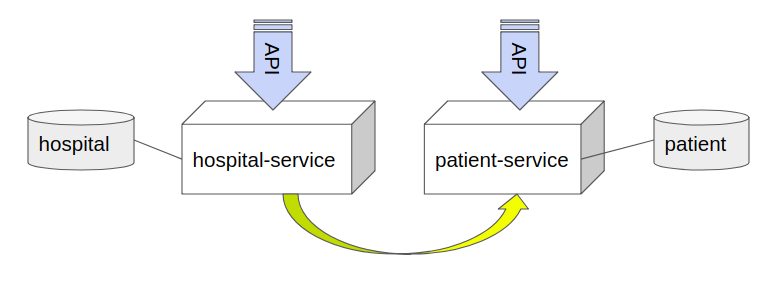

# Sample microservices application with Spring Boot, Zuul, Eureka, PostgreSQL and RabbitMQ

[](https://raw.githubusercontent.com/dtodo1paco/microservices-springboot/master/LICENSE.txt)

Based on https://github.com/cassiomolin/microservices-springboot

Sample microservices application for managing Patients and Hospital using:

- **Spring Boot:** Framework for creating standalone Java applications.
- **PostgreSQL:** SQL database.

This application consists of 2 different services:

- **Patient service:** Provides API for managing patients. By default it runs on port `8081`.
- **Hospital service:** Provides API for managing Hospital Areas. By default it runs on port `8082`. This service implements a Patient Service REST Client to get Patients linked to a specific Hospital Area.

See the diagram below:

<!-- Hack to center the image in GitHub -->
<p align="center">
  
</p>

## ToDo
1. Create a service registry
1. Register both services in service registry
1. Implement service-discovery for each registered service
1. Implement an API gateway to balance between service servers

## External services

This application depends on external services that must be up and running before attempting to run the application:

### PostgreSQL

Hospital and Patient services use PostgreSQL for persistence, but different databases are used for each service.

Before running the application, ensure that you have a PostgreSQL instance running on `localhost` port `5432` (default port). The `microservices_patient` and `microservices_hospital` databases will be created by the application if they don't exist.


## Building and running this application

To build and run this application, follow these steps:

1. Open a command line window or terminal.
1. Navigate to the root directory of the project, where the `pom.xml` resides.
1. Compile the project: `mvn clean compile`.
1. Package the application: `mvn package`.
1. Run `run.sh` to start services.
1. Run `test.sh` to make some test on the services.

### Running the Patient service application

1. Open a command line window or terminal on `/services/patient-service/target` directory.
1. Start the `patient-service` application: `java -jar patient-service-1.0.jar`.
1. This service will start on the port `8081`.

### Running the Hospital service application

1. Open a command line window or terminal on `/services/hospital-service/target` directory.
1. Start the `patient-service` application: `java -jar patient-service-1.0.jar`.
1. This service will start on the port `8081`.

## REST API overview

The application provides a REST API for managing tasks. See the [curl][] scripts below with the supported operations:

### Create a HospitalArea

```bash
curl -sS -H "Content-Type: application/json" \
 -X POST localhost:8082/hospitalArea/add \
 -d '{"name":"Emergencies"}' 
```

### Create a Patient

```bash
curl -sS -H "Content-Type: application/json" \
-X POST localhost:8081/patients \
-d '{"givenName":"Max","familyName":"Colorado","birthDate":"1942-10-11", "hospitalAreaId":1}'
```

### Get all Patients

```bash
 curl -sS localhost:8081/patients
```

### Get a Patient

```bash
 curl -sS localhost:8081/patients/{id}
```

### Get Patients of a HospitalArea shopping lists

```bash
curl -sS localhost:8082/hospitalArea/2/patients
```


## Targeting the REST API with Postman

Alternatively to [curl][], you can use [Postman][] to target the REST API. 

[Postman]: https://www.getpostman.com/
[curl]: https://curl.haxx.se/